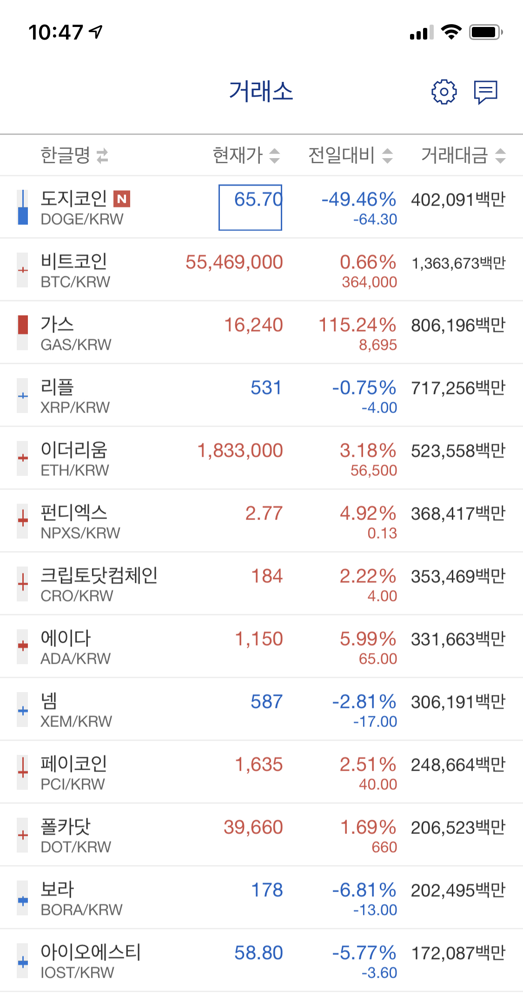

#  RxUpbitTicker

토이 프로젝트를 통해 RxSwift에 대한 이해도를 높이는 프로젝트

Upbit에서 제공하는 API를 통해 업비트 시세 조회앱을 만들어보면서 RxSwift의 이해도를 높힌다.

## 구현할 기능

- 업비트에 등록된 KRW 마켓의 모든 종목에 대한 현재 시세 모니터링 기능

## 개발 환경

- XCode12.4
- Swift5.3.2
- macOS11.2.1
- iOS13 target

## 사용 라이브러리

- RxSwift
- RxCocoa
- StarScream (WebSocket)
- SwiftLint

## 구상하는 아키텍처 패턴

- MVVM

## 디자인 목업

